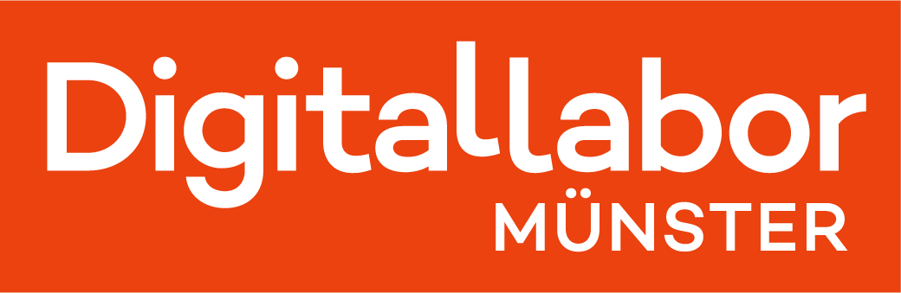

  
  &nbsp;&nbsp;&nbsp;&nbsp;&nbsp;&nbsp;&nbsp;&nbsp;&nbsp;&nbsp;
  

# Escape & Make: Durch Tinkern, Coding und Making zum Meisterdieb

## Ansatz und Motivation
Escape & Make ist ein Vermittlungsangebot, das den Teilnehmenden ermöglicht, digitale Werkzeuge, die für den Einsatz im Bildungsbereich geeignet sind, auf spielerische Weise zu entdecken. Es kann mit Kindern ab 9 Jahren als auch mit Erwachsenen durchgeführt werden. 

Als städtische Bildungseinrichtung und Schulträger haben wir das Angebot entwickelt, damit unsere Schüler:innen und Lehrkräfte neue Technologien aus den Bereichen Making, Coding und Tinker kennenlernen und für sich entdecken. Eine weitere Motivation stellt die umfassende Ausstattung im Bereich Making dar, die wir als Kommunales Medienzentrum in 2024 vom Ministerium für Schule und Bildung Nordrhein-Westfalen über das Landespilotprojekt "Digital Making Places" erhalten haben mit dem Ziel, die Werkzeuge für unsere Schulen nutzbar und verfügbar zu machen.

In Kooperation mit der Universtität Münster wurde Escape & Make im Rahmen des Projekts Euregionale Bildungskette (EDL)ins Niederländische übersetzt. (Ansatz?? LINK?)

## Einleitung 
Escape & Make folgt einer von **Escape-Spielen** inspirierten Erzählstruktur über einen Meisterdieb, der für seinen nächsten großen Raubzug nach geeigneten Rekrut:innen unter den Teilnehmenden sucht. Die Teilnehmenden tauchen in die Welt des Diebes ein, der ihnen das Angebot macht, ihn bei seinem nächsten großen Raubzug zu unterstützen. Allerdings müssen sie vorab ihr Können unter Beweis zu stellen, indem sie bei der Vorbereitung des Raubzugs helfen und sich den Rätseln und Aufgaben des Meisterdiebs stellen.

Die Aufgaben bestehen aus **7 Stationen**. An jeder Station müssen zunächst Rätsel gelöst werden, bevor die eigentliche Aufgabe mit den digitalen Werkzeugen umgesetzt werden kann. Hier verbinden sich klassische "Escape Game"-Elemente mit praktischer Medienkompetenz. Nur wenn es den Teilnehmenden gelingt, sowohl die Rätsel zu lösen als auch die richtige Ausführung der Aufgaben abzuliefern, werden sie für den großen Coup engagiert. Die Aufgaben werden im Team von min. 2 und max. 5 Teilnehmenden gelöst. Dafür haben die Meisterdieb-Rekturt:innen 60 Minuten Zeit. Detaillierte Umsetzungshinweise liegen im Ordner "Anleitung" ab. 

## Die sieben Stationen

| Station | Aufgabe | Technologie |
|---------|---------|-------------|
| 1 Das Überwachungsvideo | Überwachungsvideo ersetzen | Greenscreen-Filmtechnik |
| 2 Die Schlüsselkarte | Schlüsselkarte fälschen | Lasercutting |
| 3 Der Doppelgänger USB-Stick| USB-Stick duplizieren | 3D-Druck |
| 4 Der Lichtschalter | Lichtschalter betätigen | programmierbarer Roboter|
| 5 Der Drohnenflug | Datenstick transportieren | Drohnenfliegen mit Code |
| 6 Das Erpresserviedeo | Erpresservideo drehen | Stop Motion Filmtechnik |
| 7 Der Presseartikel | Presseartikel verfassen | Künstliche Intelligenz |

## Zielgruppe

Das Konzept eignet sich für Gruppen von 14 bis 35 Personen ab ca. 9 Jahren. Die Teilnehmer:innen arbeiten in Kleingruppen (2 bis 5 Personen pro Station) und benötigen keine Vorkenntnisse im Umgang mit den gelisteten Technologien. Jedoch sollten möglichst alle Stationen von einer Person begleitet werden. Wir haben mit einer Gruppengröße von 30 Personen das Format mit jeweils einer Person an zwei Stationen erfolgreich umgesetzt. 

## Zeitrahmen

- **Gesamtdauer:** ca. 180 Minuten
- **Einführung:** 30 Minuten
- **Stationsarbeit:** 60 Minuten
- **Finale & Präsentation der Arbeitsergebnisse:** 30 Minuten
- **Freies Experimentieren:** restliche Zeit

## Geräte und Software

Die Auswahl der Geräte und Anwendungen erfolgte auf Basis unserer Erfahrungswerte aus der Zusammenarbeit mit Schulen. Welche Werkzeuge erlauben einerseits schnelle Produktergebnisse und eröffnen andererseits Möglichkeiten der Differenzierung? Welche Anwendungen fördern Kreativität, Problemlösungskompetenz und Teamarbeit? Und welche  schon ab der 3./4. Klasse sinnvoll angewendet werden? 

Unsere erste Version von „Escape & Make” wurde im Frühjahr 2025 erstellt, beinhaltete jedoch nur Geräte und Anwendungen, die wir vor der Landesinitiative „Digital Making Places” angeschafft hatten. In der aktuellen Version stehen an zwei Stationen jeweils zwei Geräte zur Auswahl, weil wir die neuen Geräte aus dem Förderpaket eingebunden haben. 

Im Laufe der Zeit mussten wir jedoch mehrfach feststellen, dass uns entweder der technologische Wandel überholt oder die Herstellerabhängigkeit eingeholt hat. So mussten wir beispielsweise das KI-Bilderrätsel in der Station 3D-Druck neu gestalten, da KI-generierte Bilder innerhalb eines Jahres nicht mehr anhand der „typischen KI-Bildfehler” als solche erkennbar waren. An anderer Stelle hat der Hersteller der von uns verwendeten Minidrohnen beschlossen, keine weiteren Drohnen zu produzieren und die von uns genutzte Edu-App zum Drohnenfliegen einzustellen. Dies waren Rückschläge bei der Fertigstellung des Angebots, aber auch Erfahrungen, die wir in Zukunft immer häufiger machen werden. 

## Inhalt dieses Repositories: 

Hier sind alle Materialien und Informationen hinterlegt, die benötigt werden, um das Angebot selbstständig durchzuführen. Dazu gehören finale Dateien, offene Unterlagen für die eingene Anpassung sowie Anleitungen für die Erstellung von Material. 

- **Anleitung:** Detaillierte Stationsanleitungen mit Lösungen für die anleitende Person
- **Einleitung und Finale:** Präsentationen für die Einführung sowie den Abschluss
- **TaskCard Pinnwand:** Arbeitsumgebung für die Umsetzung mit den Teilnehmenden 
- **7 Stationen:** offene Arbeitsdateien, Dateien für die TaskCard, Druck- und Umsetzungsmaterialien

### Lizenzen

**Escape & Make © 2025** vom [Digitallabor](https://www.digitallabor.ms/) ist lizenziert unter einer [Creative Commons Namensnennung - Nicht-kommerziell - Weitergabe unter gleichen Bedingungen 4.0 International Lizenz (CC BY-NC-SA 4.0)](http://creativecommons.org/licenses/by-nc-sa/4.0/).
Beachten Sie dennoch die unter Lizenzen angegebenen Verwendungshinweise, insbesondere die kopiergeschützten Inhalte.

### Hinweise zu Drittmaterialien
Einige in diesem Projekt verwendete Materialien stammen aus externen Quellen mit eigenen Lizenzbedingungen:

| Material | Quelle | Lizenz/Hinweis |
|----------|--------|----------------|
| Icons | [Canva](https://www.canva.com/) Elementbibliothek | Canva Content License |
| Einzelne Rätselgrafiken | Mit KI-Unterstützung (ChatGPT 4.0) erstellt | – |
| Videoelemente | Canva Videogenerator | Canva Content License |
| Alpaka_4.png| Unsplash | Foto von <a href="https://unsplash.com/de/@szamanm?utm_source=unsplash&utm_medium=referral&utm_content=creditCopyText">Piotr Musioł</a> auf <a href="https://unsplash.com/de/fotos/braunes-kamel-auf-braunem-feld-tagsuber-wUqNZ3OQfFs?utm_source=unsplash&utm_medium=referral&utm_content=creditCopyText">Unsplash</a>|
| Alpaka.png 1-3| Mit KI-Unterstützung (Nano Banana Pro) | – |
| Café_2.png | Unsplash | Foto von <a href="https://unsplash.com/de/@rawkkim?utm_source=unsplash&utm_medium=referral&utm_content=creditCopyText">rawkkim</a> auf <a href="https://unsplash.com/de/fotos/ein-paar-leute-sitzen-auf-einer-bank-wQUD2xYXCqo?utm_source=unsplash&utm_medium=referral&utm_content=creditCopyText">Unsplash</a>|
| Café.png 1,3,4  | Mit KI-Unterstützung (Nano Banana Pro) | – |
      

Diese Drittmaterialien unterliegen möglicherweise nicht der CC BY-NC-SA 4.0 Lizenz. Bei Weiterverwendung bitte die jeweiligen Lizenzbedingungen beachten.

## Mitwirkende

Dieses Projekt wurde entwickelt vom Team des **Digitallabors**:

- **Konzept & Projektleitung:** Seida Bathovic
- **Rätseldesign & Grafiken:** Lena Otte
- **Texte:** Sabine
- **Weitere Mitwirkende:** Dominik 

